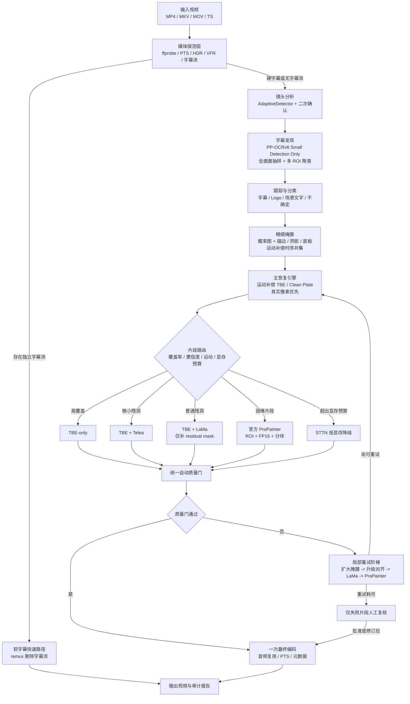
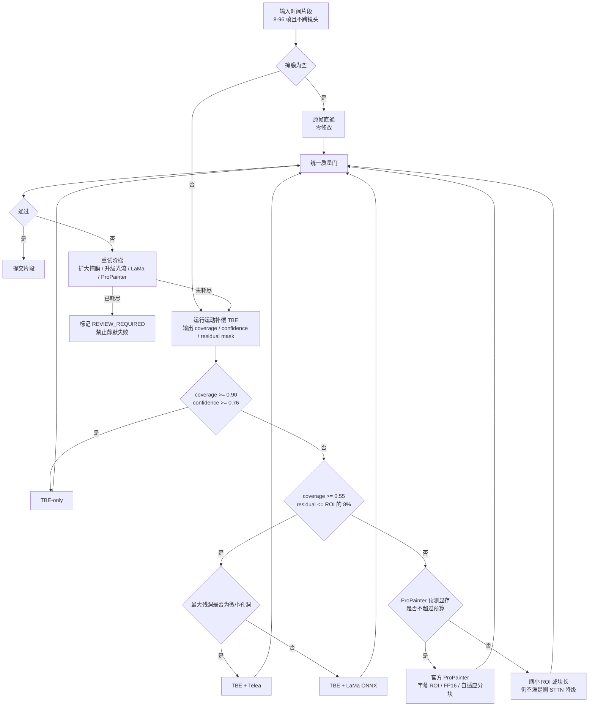
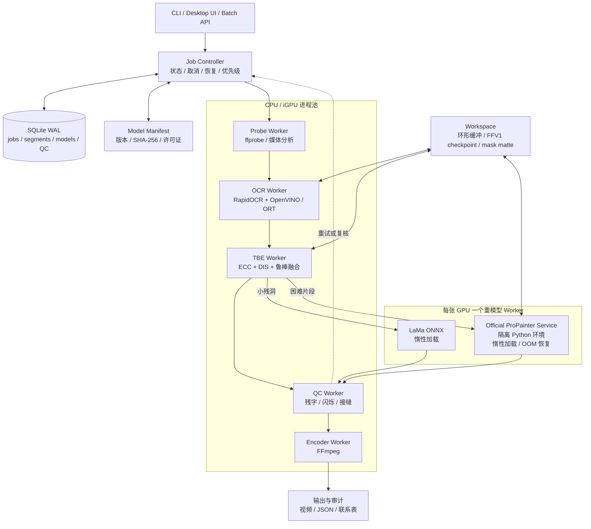
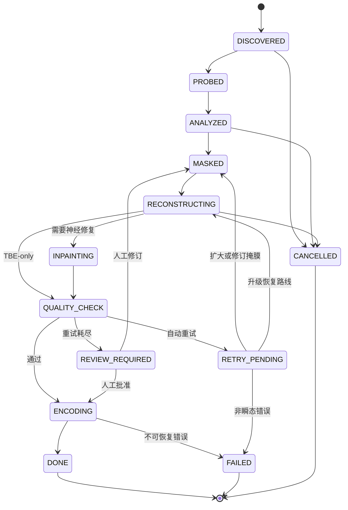

# VSR-X Hybrid 1.1
## 海量视频硬字幕去除系统：技术架构与实施规范

**文档版本：** 1.1  
**调研快照：** 2026-07-20  
**目标场景：** 非商用、本地离线、海量视频、字幕样式和位置不统一  
**首选硬件：** 8-12 GB NVIDIA GPU + 16-32 GB RAM  
**兼容模式：** 纯 CPU / Intel iGPU / Apple Silicon / 4-6 GB GPU  
**文档形态：** 纯 Markdown；不依赖图片、PDF 或 DOCX；架构图使用 Mermaid 与纯文字双重表达  

> 本文不是模型清单，而是一份可以直接据此开发的系统设计。架构目标是同时优化吞吐量、成功率、画面质量与峰值资源，并将不可避免的困难片段限制在局部重处理范围内。

## AI 读取约定

- 本文件是单文件完整规范，适合一次性加入 AI 上下文。
- 模块化版本位于 `docs/`，适合按开发阶段逐文件加载。
- `reference/` 内的配置、接口、数据库和模型清单均以 Markdown 代码块保存。
- Mermaid 图只是文本，不依赖图片；每张图后均有纯文字路径。
- 所有阈值是工程初值，发布前必须用 Golden Set 校准。

---

# 0. 最终决策

## 0.1 推荐方案

开发一个新的、模块化的 **VSR-X Hybrid Core**，不要把任一现成项目原样当作最终内核。可以复用 `SysAdminDoc/VideoSubtitleRemover` 的桌面界面、队列、掩膜编辑、FFmpeg 封装和部分工程经验，也可以参考 `YaoFANGUK/video-subtitle-remover` 的官方 ProPainter 适配，但核心处理链路应按本文重新实现。

最终默认链路为：

```text
FFmpeg/ffprobe
  -> PySceneDetect 镜头切分
  -> RapidOCR + PP-OCRv6 Small（仅文字检测）
  -> 多 ROI 发现、字幕轨迹分类、精细掩膜
  -> 运动补偿 TBE / Clean-Plate Reconstruction（主恢复路径）
  -> Telea 或 LaMa ONNX（只补残洞）
  -> 官方 ProPainter（只处理困难 ROI 片段）
  -> 自动质量门 + 局部升级重跑
  -> 一次最终编码与原音频复用
```

模型角色必须固定：

| 组件 | 在系统中的角色 | 是否默认全量运行 |
|---|---|---:|
| PP-OCRv6 Small Det | 字幕候选检测 | 是，但采用抽样和自适应帧间隔 |
| 运动补偿 TBE | 从前后帧恢复真实背景 | 是，主力 |
| OpenCV Telea | 微小孔洞 | 否，按残洞大小触发 |
| LaMa ONNX | 小到中等残洞的空间修补 | 否 |
| 官方 ProPainter | 永久遮挡、高运动、前景穿越等困难片段 | 否，只跑困难 ROI |
| STTN | ProPainter 超显存预算时的应急降级 | 否 |
| SEDiT | 未来免掩膜插件 | 暂不进入生产主链路 |

## 0.2 为什么不是“全量 STTN”或“全量 ProPainter”

全量 STTN 虽然简单，但会在不需要生成模型时仍然进行时空补全，质量上限也低于更现代的 ProPainter。全量 ProPainter 的显存与吞吐成本又不符合海量处理。最经济的办法是先利用相邻帧中真实暴露的背景；只有真实背景无法恢复的区域才调用神经修复模型。

## 0.3 可以保证什么，不能保证什么

工程上应保证：

- 不出现静默失败：残字、闪烁、接缝或异常改动画面必须触发重试或复核；
- 峰值显存受预算控制；OOM 只能影响当前片段，不能让整条视频报废；
- 作业可断点续跑，模型、参数、配置和结果可追溯；
- 非字幕区域尽量保持原像素，视频只进行一次最终有损编码；
- 大多数普通字幕片段不进入重模型。

不能承诺：当字幕从第一帧到最后一帧始终覆盖同一像素、且周围没有足够线索时，恢复结果与原始未加字幕版本逐像素一致。此时任何算法都只能生成合理背景。系统的正确做法是输出置信度并阻止不确定结果静默通过。

---

# 1. 需求定义与架构约束

## 1.1 功能需求

1. 批量递归扫描目录，支持 MP4、MKV、MOV、M4V、AVI、WebM、TS、M2TS。
2. 先识别软字幕；软字幕走无损 remux，不调用 AI。
3. 支持底部字幕、顶部字幕、双语字幕、竖排字幕、移动字幕、卡拉 OK、装饰字、半透明底板和多区域字幕。
4. 自动区分字幕、Logo、场景文字、UI 和不确定覆盖物，降低误删。
5. 自动选择恢复路径；默认无需人工框选。
6. 支持可选的手工 ROI、逐时间段 ROI、关键帧插值和外部 matte 导入。
7. 输出视频保留音频、章节、流顺序、时间戳、色彩信号和必要元数据。
8. 自动生成质量报告、模型路由统计和失败片段联系表。
9. 支持断点续跑、取消、失败恢复和仅重跑局部片段。

## 1.2 非功能需求

- **吞吐优先：** OCR 不逐帧全画面运行；神经视频修复不处理无关帧和无关像素。
- **资源有界：** 所有 GPU 路径必须有显存预测、块长控制和 OOM 降级。
- **结果稳定：** 每个镜头独立处理；禁止跨切镜引用；重模型按固定版本和哈希运行。
- **可复现：** 相同输入、配置、模型与随机种子应得到可解释的同类结果。
- **可观察：** 每个阶段记录耗时、峰值内存、路由原因、质量指标和重试历史。
- **可替换：** OCR、光流、空间修复和视频修复均通过稳定接口接入。

## 1.3 推荐性能边界

首个稳定版本应以 1080p 为主要目标，4K 采用 ROI 内降采样/分块，而不是全画面原生视频修复。8-12 GB GPU 是“平衡模式”的设计点；4-6 GB GPU 使用更小块长和 STTN 降级；CPU 模式仅承诺可完成，不承诺高吞吐。

以下均是项目验收目标，不是对所有素材的绝对性能承诺：

- 普通固定字幕中，官方 ProPainter 处理帧占比尽量低于 20%；
- 作业因单次 OOM 导致整条视频失败的比例为 0；
- 自动重试后，作业要么成功，要么明确标记 `REVIEW_REQUIRED`；
- 非字幕区域的模型改动近似为零；
- 视频只进行一次最终有损编码。

---

# 2. 开源方案调研与对比

## 2.1 现成应用项目

### 2.1.1 YaoFANGUK/video-subtitle-remover

优势：

- 用户量和使用历史较多；
- 提供 CLI、GUI、预编译包和 Docker；
- 集成 STTN、LaMa、OpenCV 与官方 ProPainter 路径；
- 适合快速建立基线和收集失败样本。

不足：

- 核心架构主要围绕“选择一个 inpaint mode”设计，缺少本文所需的 clean-plate 主路径、统一质量门与片段级预算路由；
- 若直接全量使用官方 ProPainter，显存和吞吐不适合海量素材；
- 需要额外实现字幕/Logo/场景文字分类、跨帧精细 mask、断点和质量闭环。

结论：**适合做模型基线和借鉴官方 ProPainter 适配，不宜原样作为最终内核。**

### 2.1.2 SysAdminDoc/VideoSubtitleRemover Pro

优势：

- 2026 年仍非常活跃，已有队列、现代 GUI、FFV1 中间链路、PP-OCRv6 多后端、TBE、LaMa、掩膜编辑、颜色元数据保留和多种质量工具；
- 代码结构、插件注册、模型哈希与操作体验值得直接借鉴；
- 当前发布页在调研日显示 3.22.0，说明工程仍在快速演进。

必须注意：

- 它的 `STTN` 模式实际上是 TBE；名为 `ProPainter` 的模式是 TBE + LaMa，并非 ICCV 2023 官方 ProPainter 代码或权重；
- 默认配置中 `tbe_flow_warp`、`temporal_mask_union`、`quality_report` 等关键增强默认关闭；
- 因此“安装后按默认配置运行”并不等于本文推荐的运动补偿 TBE + 官方 ProPainter 架构。

结论：**最适合复用为桌面外壳和工程参考，但核心恢复、路由和质量策略必须升级。**

### 2.1.3 其他轻量项目

大量小型项目采用 Tesseract/YOLO/边缘检测 + OpenCV inpaint，或采用固定底部区域。它们适合演示，不适合多语言、多位置、动态字幕和高质量批处理。其主要问题通常不是代码不能运行，而是缺少镜头隔离、字幕轨迹分类、时序一致性和失败闭环。

## 2.2 模型与算法对比

下表的“资源”和“工程成熟度”来自官方仓库/论文与工程判断；不同论文的测试分辨率、帧数、硬件和 mask 条件不同，不能把各论文指标直接当作同一标准榜单。

| 方案 | 类型 | 优势 | 主要问题 | 本项目结论 |
|---|---|---|---|---|
| 运动补偿 TBE | 非生成、真实像素融合 | 最低显存、真实背景、确定性强 | 字幕长期不消失时覆盖不足 | 主力 |
| OpenCV Telea | 传统单帧修补 | 极轻、稳定、CPU 友好 | 复杂纹理和大洞效果差 | 微小残洞 |
| LaMa | 单图神经修补 | 轻量、ONNX 友好、纹理能力好 | 逐帧使用会闪烁 | 只补残洞 |
| MI-GAN | 移动端单图修补 | 参数和计算小 | 质量上限低于 LaMa | CPU 经济插件 |
| STTN | 时空 Transformer | 比单帧稳定、显存低于新扩散模型 | 架构较老，复杂运动易模糊 | 低显存降级 |
| E2FGVI-HQ | 光流引导视频修补 | 任意分辨率、速度尚可 | 旧依赖、质量通常低于 ProPainter | 可选实验插件 |
| 官方 ProPainter | 光流传播 + 时空 Transformer | 成熟、复杂运动质量高 | 720p 整帧显存高，依赖较旧 | 困难 ROI 首选 |
| Streaming ProPainter | ProPainter 流式封装 | 适合长视频 | 社区 Alpha，仍受上游许可和性能约束 | 可用于适配参考 |
| Faster-ProPainter | 静态水印裁剪加速 | 固定水印场景快 | 明确偏静态水印，维护少 | 不作为通用核心 |
| MiniMax-Remover | 6 步 DiT | 比多步扩散更快 | 仍是视频 DiT；默认示例 832x480、81 帧，资源明显高于混合链路 | 研究插件 |
| VideoPainter | CogVideoX-5B 视频 DiT | 任意长度、质量潜力高 | 5B 级骨干，部署和显存不符合低资源 | 不进主链路 |
| DiffuEraser | 扩散 U-Net + ProPainter 先验 | 质量上限高 | 640x360 已约 12 GB，速度慢 | 精品离线模式而非批量 |
| CLEAR | 免掩膜字幕扩散 | 不需要外部 OCR，跨语言强 | 官方默认约 4.86 秒/帧，依赖 Wan2.1 | 不进主链路 |
| SVOR | Wan2.1-VACE 1.3B + LoRA | 对破损 mask、阴影和闪烁很强 | 默认 720p 约 33 GB，20 步 | 服务器研究模式 |
| SEDiT | 一步免掩膜 DiT | 论文显示速度/质量非常有潜力 | 调研日项目页未提供可直接复现的官方本地推理仓库与权重链接 | 未来优先评估 |

## 2.3 关键资源证据

- PP-OCRv6 提供 Tiny、Small、Medium 三档；Small/Medium 使用统一模型覆盖 50 种语言，Tiny 不含日语。Small 是桌面/移动端档位，适合作为默认检测器。
- 官方 ProPainter 的 FP16 参考显存中，720x480、50 帧约 7 GB；1280x720、50 帧约 19 GB。因此只能把它用于字幕 ROI 和短片段，而不能把 1080p 整帧全量送入。
- DiffuEraser 官方数据中，250 帧在 L20 上：640x360 约 12 GB/92 秒，1280x720 约 33 GB/314 秒。
- CLEAR 默认 5 步配置报告约 4.86 秒/帧，并以 Wan2.1 为基础。
- SVOR 默认 720x1280 推理约需 33 GB 显存；CPU offload 仍属于大模型路线。
- SEDiT 论文提出一步、免掩膜、分块流式推理并报告很强结果，但当前公开可复现性不足，不能把第一版产品押在它上面。

## 2.4 工程加权决策矩阵

权重：吞吐 25%、修复质量 25%、资源 20%、稳定/可控 15%、集成难度 10%、成熟度 5%。分数是针对本需求的工程评估，不是标准化学术 benchmark。

| 方案 | 吞吐 | 质量 | 资源 | 稳定可控 | 集成 | 成熟 | 加权结论 |
|---|---:|---:|---:|---:|---:|---:|---:|
| **VSR-X 混合架构** | 9.2 | 8.8 | 9.0 | 9.2 | 7.6 | 8.0 | **8.85** |
| SysAdminDoc 默认/轻调 | 8.5 | 7.4 | 8.4 | 7.8 | 9.0 | 7.5 | 8.00 |
| Yao VSR 多模型手工选择 | 7.2 | 7.8 | 6.8 | 7.0 | 8.5 | 9.0 | 7.45 |
| 全量官方 ProPainter ROI | 5.8 | 8.8 | 5.8 | 7.8 | 6.8 | 8.2 | 7.02 |
| 全量 STTN | 8.0 | 6.5 | 8.0 | 7.0 | 7.8 | 7.8 | 7.35 |
| CLEAR | 2.5 | 8.8 | 2.8 | 6.0 | 4.5 | 5.5 | 5.05 |
| SVOR | 2.2 | 9.0 | 1.8 | 6.5 | 4.0 | 5.0 | 4.82 |
| SEDiT（按论文潜力） | 8.5 | 9.2 | 未验证 | 6.0 | 2.0 | 2.5 | 暂不评分 |

因此，没有一个现成仓库能同时把你的四个目标做到最优。**最合理的方案是“新内核 + 复用成熟外壳 + 模型插件化”。**

---

# 3. 总体技术架构

## 3.0 总体处理流程（Mermaid 文本架构图）



**纯文字路径：** 输入探测 -> 软字幕无损路径或硬字幕处理 -> 镜头切分 -> 字幕发现与分类 -> 精细掩膜 -> TBE 真实背景恢复 -> 片段路由 -> 局部修补/视频修复 -> 质量门 -> 局部重试或最终编码。

## 3.1 分层设计

系统划分为六层：

1. **媒体与作业层**：输入发现、ffprobe、软字幕快速路径、作业状态和断点；
2. **理解层**：镜头切分、字幕发现、轨迹跟踪、字幕/Logo/场景文字分类；
3. **掩膜层**：文字概率图、描边/阴影/底板扩展、跨帧运动补偿；
4. **恢复层**：TBE、Telea、LaMa、官方 ProPainter、STTN；
5. **质量层**：残字、闪烁、接缝、保真、清晰度、颜色和自动重试；
6. **交付层**：一次最终编码、流复用、审计报告和联系表。

## 3.2 核心原则

- **真实像素优先于生成像素。**
- **片段级路由优先于整条视频选模型。**
- **模型只看字幕 ROI，非字幕区域原样保留。**
- **不跨镜头引用。**
- **不确定结果必须显式暴露。**
- **每个重模型都在隔离进程中，所有中间状态可恢复。**

---

# 4. 仓库与模块划分

建议仓库结构：

```text
vsrx/
  pyproject.toml
  README.md
  configs/
    balanced.yaml
    fast.yaml
    quality.yaml
    cpu_economy.yaml
    model_manifest.yaml
  src/vsrx/
    app/
      cli.py
      api.py
      controller.py
    domain/
      contracts.py
      enums.py
      errors.py
    media/
      probe.py
      decode.py
      encode.py
      stream_map.py
      color.py
    scene/
      detector.py
      transition.py
    detection/
      rapidocr_adapter.py
      roi_discovery.py
      sampler.py
    tracking/
      association.py
      kalman.py
      track_classifier.py
    mask/
      probability_mask.py
      text_effects.py
      panel_detector.py
      temporal_union.py
      matte_io.py
    motion/
      global_registration.py
      dis_flow.py
      raft_adapter.py
      confidence.py
    cleanplate/
      reference_selector.py
      exposure.py
      fusion.py
      coverage.py
    routing/
      features.py
      budget.py
      router.py
    inpaint/
      telea.py
      lama_onnx.py
      migan_onnx.py
      propainter_client.py
      sttn_client.py
    quality/
      residual_text.py
      flicker.py
      seam.py
      preservation.py
      report.py
      retry.py
    scheduler/
      db.py
      state_machine.py
      worker_pool.py
      checkpoints.py
    reporting/
      audit.py
      contact_sheet.py
      metrics.py
  services/
    propainter_worker/
    sttn_worker/
  tests/
    unit/
    integration/
    golden/
  tools/
    benchmark.py
    calibrate_thresholds.py
    inspect_masks.py
```

## 4.1 为什么官方 ProPainter 要做独立服务

上游 ProPainter 依赖较老的 PyTorch/Python 组合，而主控制器、RapidOCR、OpenVINO 和 GUI 可以使用更现代的 Python。强行放入同一环境容易发生 Torch、OpenCV、NumPy、CUDA 和 ONNX Runtime 冲突。推荐：

- 主进程：Python 3.12/3.13；
- ProPainter Worker：独立 Python 3.10 或经过验证的容器；
- 通过本地 Unix Socket、Named Pipe 或 gRPC 传入 manifest 和文件/共享内存句柄；
- Worker 惰性加载模型、串行执行重任务；OOM 后重启 Worker，不影响控制器。

---

# 5. 媒体探测与软字幕快速路径

## 5.1 ffprobe 数据

必须记录：

- 所有流的 index、codec_type、codec_name、language、title、disposition；
- video time_base、avg_frame_rate、r_frame_rate、start_time、duration；
- width、height、sample_aspect_ratio、display_aspect_ratio；
- pix_fmt、color_range、color_space、color_transfer、color_primaries；
- HDR side data、章节、附件、旋转信息；
- 是否隔行、是否 VFR。

## 5.2 软字幕路径

发现独立字幕流时，默认 `remove`：

```bash
ffmpeg -i input.mkv -map 0 -map -0:s? -c copy output.mkv
```

对于需保留附件字体、章节和多音轨的容器，应使用显式 stream map 和 metadata/chapter map。软字幕路径完成后直接进入输出审计，不允许再跑 OCR。

## 5.3 VFR 与时间戳

系统内部主键使用 `pts_us`，而不是假设 `frame_index / fps`。所有轨迹、片段、mask 和质量报告都保存微秒时间戳。帧序号只作为当前解码次序的辅助字段。最终编码要从源帧 PTS 恢复节奏，避免 VFR 变速或音画漂移。

---

# 6. 镜头切分

使用 PySceneDetect `AdaptiveDetector` 作为默认候选生成器。该检测器对相邻内容差异采用滚动均值，有助于降低快速摄像机运动造成的假切镜。随后增加直方图/感知哈希二次确认。

默认参数：

```yaml
adaptive_threshold: 3.0
min_scene_len_frames: 10
rolling_window_frames: 2
min_content_val: 15.0
histogram_confirmation_threshold: 0.42
```

切镜规则：

- 硬切立即结束当前引用窗口；
- 淡入淡出建立 transition 区，不用过渡区帧作为远端参考；
- 短于 5 帧的 shot 默认标记高风险；
- 所有 OCR 轨迹、mask union、光流缓存、clean plate 和重模型状态在切镜时重置。

---

# 7. 字幕发现、跟踪与误删防护

## 7.1 两阶段检测

### 阶段 A：全画面发现

每条视频在以下位置抽样：

- 开头 20 秒；
- 结尾 20 秒；
- 中间等距 3 个窗口；
- 每个镜头的起始/中间代表帧；
- 全程每 8 秒一次低频全画面复扫。

默认每 0.75 秒抽一帧，以 PP-OCRv6 Small 运行 detection-only。检测框按归一化坐标、文字高度、角度、持续时间和运动行为聚类，生成最多 4 个候选 ROI。

### 阶段 B：ROI 内自适应检测

- 稳定对白：每 4 帧检测；
- 长时间静止：每 7 帧检测；
- 出现/消失边界：逐帧；
- 移动字幕、滚动字幕、卡拉 OK：逐帧；
- 中间帧使用局部光流传播，失败再用 Kalman 预测。

## 7.2 为什么选择 PP-OCRv6 Small

- Tiny 更省资源，但不含日语且在艺术字和通用场景上精度更低；
- Medium 更强，但没有必要全程运行；
- Small 适合桌面/移动场景，支持统一 50 语言检测，是准确率与吞吐的平衡点；
- 当 track 置信度低、输出仍有残字、艺术字概率高或压缩严重时，才对局部片段升级 Medium。

使用 RapidOCR 作为部署层，后端顺序建议：

```text
Intel CPU/iGPU: OpenVINO
NVIDIA GPU: ONNX Runtime CUDA
通用 CPU: ONNX Runtime CPU
```

仅检测时不加载识别模型；只有用户启用“按语言删除”或字幕/场景文字分类不确定时才运行识别。

## 7.3 轨迹关联

每个检测框转换为轨迹，Hungarian 代价：

```text
cost = 0.35*(1-IoU)
     + 0.20*center_distance
     + 0.15*height_ratio_error
     + 0.10*angle_error
     + 0.20*appearance_error
```

`max_gap_frames=8`，`min_track_frames=3`。关联只能在同一镜头内发生。

## 7.4 字幕轨迹分类

检测到“文字”不等于应该删除。对每条 track 计算：

- OCR/检测置信度；
- 归一化屏幕坐标稳定性；
- 典型字幕节奏：持续 0.5-8 秒、文本/轮廓周期性变化；
- 布局先验：底部居中、顶部标题、双语对齐、卡拉 OK 行；
- 覆盖物与场景运动解耦程度；
- 局部对比度、描边和阴影特征；
- 是否长期不变；
- 是否位于角落且像 Logo；
- 文字运动是否跟随场景平面；
- 可选 VAD：对白出现时轨迹是否出现。

建议评分：

```text
score = 0.18*detector_confidence
      + 0.18*screen_coordinate_stability
      + 0.16*subtitle_cadence
      + 0.12*layout_prior
      + 0.10*local_contrast
      + 0.16*overlay_motion_decoupling
      + 0.10*audio_vad_alignment
      - 0.22*logo_persistence
      - 0.28*scene_motion_coupling
      - 0.12*tiny_corner_mark
      - 0.15*long_unchanged_content
```

路由：

- `score >= 0.62`：自动删除；
- `0.45 <= score < 0.62`：不确定，默认生成复核建议；
- `< 0.45`：保护，不删除。

自动模式下宁可漏掉不确定场景文字，也不要误删重要画面元素。

---

# 8. 精细掩膜生成

## 8.1 基础 mask

优先使用检测器 probability map，而不是只把多边形框涂满。框内阈值建议 0.28，并保留字符间空隙和边缘概率。若后端不提供概率图，才使用 DB unclip 后的多边形。

## 8.2 描边、阴影、发光和底板

在每个候选框周围建立局部 Lab patch：

1. 以高置信字符像素作为 seed；
2. 根据与 seed 的颜色差、亮度梯度和连通性扩展；
3. 扩展方向允许非对称，以覆盖右下偏移阴影；
4. 对卡拉 OK 使用 HSV 饱和度和帧间颜色变化辅助；
5. 对半透明底板检测大面积低频矩形/圆角连通域；
6. 底板只在轨迹分类高置信时纳入，防止吞掉真实 UI。

膨胀半径按文字高度而不是固定像素：

```text
d = clamp(round(text_height * 0.12), d_min, d_max)
```

建议：720p 为 3-7 px，1080p 为 5-11 px；质量重试每次增加 3 px。

## 8.3 运动补偿时序并集

不能直接对前后帧 mask 做坐标原位并集，否则相机运动时会扩大错误区域。对当前帧 t：

```text
M_union(t) = M(t)
             OR warp(M(t-1), flow(t-1 -> t))
             OR warp(M(t+1), flow(t+1 -> t))
```

时间半径默认 1 帧；运动模糊/字幕动画可增到 2。最后执行 3 px 闭运算、孔洞填充和小连通域去除。

## 8.4 软边合成

硬 mask 只用于模型；回贴使用距离变换得到 soft alpha。1080p 默认羽化 5 px。羽化不能替代正确 mask：残字应扩大硬 mask，而不是靠模糊隐藏。

---

# 9. 运动补偿 TBE / Clean-Plate 主引擎

## 9.1 设计目标

对目标帧 t，在同一镜头前后搜索字幕未遮挡的参考像素，将其几何和曝光对齐到 t，再进行鲁棒融合。输出：

- `clean_plate`；
- 每像素 coverage；
- 每像素 confidence；
- residual mask；
- 参考帧清单和评分。

## 9.2 两级配准

### 全局配准

顺序：

1. ECC affine；
2. ORB + RANSAC affine；
3. identity。

配准特征排除字幕 mask 与画面边缘低信息区域。最大边降到 960 计算，提高速度。

### ROI 局部光流

全局变换后，只在字幕 ROI + 96 px 上下文计算 OpenCV DIS：

- 默认 `PRESET_FAST`；
- 质量重试切换 `PRESET_MEDIUM`；
- 可选 RAFT-Small 作为 GPU 插件，但不应默认依赖。

使用正反向一致性：

```text
fb_error(x) = ||F(t->j, x) + F(j->t, x + F(t->j,x))||
```

`fb_error > 1.8 px`、越界、参考帧被 mask 或发生遮挡的像素均判为无效。

## 9.3 参考帧选择

默认前后各 0.9 秒，最少 0.4 秒，最大 1.5 秒；每侧最多 36 帧。评分：

```text
S_j(x) = 0.30*flow_consistency
       + 0.25*photometric_ring_similarity
       + 0.15*gradient_ring_similarity
       + 0.15*exposure_fit_quality
       + 0.15*temporal_proximity
```

参考帧要求：

- 与目标帧同镜头；
- 目标像素在参考帧未被字幕 mask；
- 光流正反向一致；
- mask 外环的亮度、梯度与目标帧一致；
- 不被新前景遮挡。

## 9.4 曝光与色彩补偿

在 mask 外 8-24 px ring 上拟合每通道仿射：

```text
I_target ~= a * I_warped_reference + b
```

使用 Huber/截断最小二乘，避免人物或高光干扰。只在拟合残差低于阈值时应用。

## 9.5 鲁棒融合

对每个待恢复像素 x，收集有效候选 `v_j(x)` 和权重 `w_j(x)`。默认使用 weighted median，因为它能抵抗少量错配、运动物体和曝光异常。至少 3 个有效参考；5 个以上更可靠。

```text
coverage(x) = min(valid_count(x) / preferred_count, 1.0)
confidence(x) = weighted_mean(S_j(x)) * occlusion_validity(x)
```

残洞定义：

```text
residual(x) = original_mask(x)
              AND (coverage(x) < c_min OR confidence(x) < q_min)
```

## 9.6 为什么这个引擎最符合需求

- 字幕变化会周期性暴露不同的真实背景；
- 绝大多数计算在小 ROI 中进行；
- 不加载大视频生成模型；
- 真实像素比生成内容更稳定、可复现；
- 对皮肤、衣服、头发、地面等细节不会凭空重绘；
- 即使失败，也能通过 coverage/confidence 明确知道失败位置。

---

# 10. 片段级模型路由

## 10.0 片段路由决策图（Mermaid 文本架构图）



**决策优先级：** 原帧直通 > 真实像素恢复 > 传统微孔修补 > LaMa 小范围生成 > ProPainter 困难视频修复 > STTN 资源降级 > 人工复核。

## 10.1 片段划分

路由粒度为同一镜头内的时间片段，默认 8-96 帧。以下事件切片：

- 字幕轨迹出现/消失；
- ROI 或 mask 面积突变；
- clean-plate coverage 跨阈值；
- 运动分数显著变化；
- 前景穿越字幕；
- 切镜。

## 10.2 默认路由阈值

```python
if mask_is_empty:
    route = COPY
elif coverage >= 0.90 and confidence >= 0.76 and flicker_risk <= 0.38:
    route = TBE_ONLY
elif coverage >= 0.55 and residual_ratio_of_roi <= 0.08:
    if largest_residual_component <= micro_hole_threshold:
        route = TBE_TELEA
    else:
        route = TBE_LAMA
else:
    if predicted_propainter_vram <= budget:
        route = OFFICIAL_PROPAINTER
    else:
        route = STTN_FALLBACK
```

这些阈值是初始值，必须通过项目 golden set 校准。

## 10.3 何时直接进入官方 ProPainter

满足任一：

- coverage < 0.55；
- 平均光流置信度 < 0.52；
- 前景穿越分数 > 0.35；
- 字幕始终存在且无有效 clean plate；
- mask 占整帧 > 6%；
- 动态底板、复杂卡拉 OK 或装饰字造成大面积残洞；
- TBE + LaMa 质量门失败。

## 10.4 高风险转人工复核

- mask 占整帧 > 18%；
- 轨迹字幕置信度 < 0.45；
- 镜头短于 5 帧；
- 严重运动模糊 > 0.82；
- 满屏弹幕或字幕与关键 UI 高度重叠。

---

# 11. 空间修补：Telea、LaMa 与 MI-GAN

## 11.1 Telea

只处理等效直径很小的连通域，例如 1080p 下不超过约 24 px。它几乎不增加依赖，CPU 速度快，但不能处理复杂纹理和长条大洞。

## 11.2 LaMa ONNX

约束：

- 输入是 `residual_mask`，不是完整字幕 mask；
- 只裁剪 residual bbox + 64 px 上下文；
- 512 tile，64 overlap；
- CUDA 用 FP16，Intel 优先 OpenVINO；
- 合成时非 residual 区严格使用 TBE/原图，不允许 LaMa 改写整块 ROI。

逐帧 LaMa 的闪烁风险通过“只生成少量残洞”大幅降低。仍需运行时序 QC。

## 11.3 MI-GAN

可作为 CPU 经济模式插件。适合对吞吐高于质量的设备；默认关闭，不应成为平衡模式基线。

---

# 12. 官方 ProPainter 适配规范

## 12.1 只处理 ROI

对一个片段取所有 residual mask 的联合 bbox，增加 48-96 px 上下文，裁剪尺寸对齐到 8 或 16。模型输出只通过 soft mask 合成回原帧；ROI 外不经过模型。

## 12.2 块处理

平衡模式起始参数：

```yaml
fp16: true
subvideo_length: 32
neighbor_length: 6
ref_stride: 10
chunk_overlap_frames: 8
roi_padding_1080p: 64
```

- 不允许 chunk 跨镜头；
- 输出只提交 chunk 中间有效区；
- 重叠区以时间权重融合；
- 每个 chunk 完成后写 checkpoint。

## 12.3 显存预算预测

不能只按分辨率线性外推，因为时序模型还依赖帧数和内部特征。采用两层预算：

1. 经验估算表：分辨率、帧数、精度；
2. 当前设备冷启动 micro-benchmark，建立 `(pixels, frames, fp16) -> peak_vram` 回归。

预留：

```text
usable_vram = total_vram - driver_reserve - model_reserve - safety_margin
safety_margin = max(1024 MB, total_vram * 0.12)
```

## 12.4 OOM 降级阶梯

1. 清理缓存并重启当前 Worker；
2. `subvideo_length: 32 -> 24 -> 16`；
3. `neighbor_length: 6 -> 4`；
4. ROI padding 减小，但不得低于 32 px；
5. ROI 内等比降采样到 0.85/0.70；
6. 切换 STTN；
7. 仍失败则 `REVIEW_REQUIRED`。

禁止在同一 GPU 并发两个重视频模型任务。

## 12.5 许可证

官方 ProPainter 为非商用许可，符合本项目当前个人/非商用前提。即使外层封装项目使用 MIT，也不能改变官方权重的许可证。模型 manifest 必须记录许可证和来源。

---

# 13. 自动质量门与重试闭环

## 13.1 统一质量指标

### 残字检测

在输出 ROI 重新运行 PP-OCRv6 Small；失败重检用 Medium。需要比较：

- 输出文字置信度；
- 原 mask 内文字概率下降幅度；
- 新文字响应是否出现在 mask 外；
- 细碎描边残留，可由边缘连通域补充检测。

### 时序闪烁

对相邻输出帧进行光流对齐，只比较修复区域：

```text
flicker_t = robust_mean(
    abs(output_t - warp(output_(t-1), flow_(t-1->t)))
    within union(mask_t, warped_mask_(t-1))
)
```

用 mask 外 ring 作为自然运动基线，避免把真实运动误判为闪烁。

### 接缝检测

比较 soft mask 边界两侧：

- 梯度跳变；
- 色差 DeltaE；
- 模糊度突变；
- 规则矩形边。

### 非字幕区域保真

ROI 外必须是原始像素；ROI 内 mask 外的改动也应接近零。发现模型大范围改写立即失败。

### 清晰度与颜色

比较修复区和 ring 的 Laplacian variance、局部频谱以及 Lab 均值。过度模糊或色偏触发降级/重试。

## 13.2 重试阶梯

```text
Attempt 0: 当前路由
Attempt 1: mask 扩大 3 px + 重建 TBE
Attempt 2: DIS Fast -> Medium；参考窗口扩大
Attempt 3: TBE + LaMa
Attempt 4: 官方 ProPainter ROI
Attempt 5: 更短块/更大 mask/质量参数
耗尽: REVIEW_REQUIRED
```

重试只覆盖失败时间片段和少量前后上下文，不重新处理整条视频。

## 13.3 质量报告

每个 segment 输出：

```json
{
  "segment_id": "shot_0032_seg_0004",
  "route": "tbe_lama",
  "attempt": 1,
  "passed": true,
  "metrics": {
    "residual_text_score": 0.08,
    "flicker_score": 0.12,
    "seam_score": 0.09,
    "outside_mask_mae": 0.0004,
    "sharpness_ratio": 0.93
  },
  "model_hashes": {},
  "peak_vram_mb": 1850,
  "elapsed_seconds": 3.42
}
```

---

# 14. 运行时与部署架构

## 14.0 运行时部署图（Mermaid 文本架构图）



**部署约束：** 主控制器与轻量模块使用现代 Python 环境；官方 ProPainter 使用独立、冻结依赖的 Worker；每张 GPU 同时只运行一个重模型任务。

## 14.1 Worker 分工

- `Probe Worker`：ffprobe、流映射、VFR/HDR/隔行分析；
- `OCR Worker`：抽样、检测、轨迹候选；
- `TBE Worker`：全局配准、DIS、参考选择和融合；
- `Spatial Worker`：Telea/LaMa；
- `ProPainter Worker`：每张 GPU 仅一个；
- `QC Worker`：质量检测；
- `Encoder Worker`：最终 mux/encode。

OCR、TBE、QC 可以在 CPU 上流水并行；重 GPU Worker 串行。编码可与下一条视频的分析重叠，但需要限制 I/O 并发。

## 14.2 队列与背压

采用有界队列：

```text
probe_queue: 4 jobs
ocr_queue: 2 jobs
reconstruction_queue: 2 shots
heavy_gpu_queue: 1 active + 2 waiting
encode_queue: 2 jobs
```

当工作盘空间、RAM 或显存达到高水位时，控制器暂停上游解码，而不是继续缓存帧。

## 14.3 帧交换

优先级：

1. 同进程：NumPy/共享内存环形缓冲；
2. 跨进程：shared memory + manifest；
3. 跨环境重模型：FFV1 小片段或无损 PNG sequence；
4. 不使用低码率 MP4 中间文件。

长视频不落盘全部 PNG。只有断点、重模型隔离和失败调试需要持久化片段。

## 14.4 模型 manifest

每个模型记录：

```yaml
name: propainter
version: upstream-v0.1.0
sha256: ...
license: NTU-S-Lab-1.0-noncommercial
source: https://github.com/sczhou/ProPainter
runtime: propainter-worker-py310-cu12
minimum_runtime_version: ...
```

默认拒绝未知哈希；允许调试绕过时必须写入审计。

---

# 15. 作业状态、数据库与断点

## 15.0 作业状态机（Mermaid 文本架构图）



**状态原则：** 所有阶段必须幂等；恢复时从最近的有效 checkpoint 继续；失败片段不应使已完成片段失效。

状态：

```text
DISCOVERED -> PROBED -> ANALYZED -> MASKED
-> RECONSTRUCTING -> INPAINTING(optional)
-> QUALITY_CHECK -> ENCODING -> DONE
```

异常分支：`RETRY_PENDING`、`REVIEW_REQUIRED`、`FAILED`、`CANCELLED`。

SQLite 使用 WAL 与外键，至少包含：

- `jobs`；
- `media_probe`；
- `shots`；
- `subtitle_tracks`；
- `segments`；
- `quality_reports`；
- `artifacts`；
- `model_runs`；
- `events`。

幂等键：

```text
(input_hash, config_hash, model_manifest_hash)
```

若三者相同且输出通过完整性校验，可直接复用。配置或模型变化只使受影响阶段失效，例如改变最终编码参数不应重新跑 OCR 和 inpaint。

---

# 16. 编码、色彩、HDR、隔行和音频

## 16.1 只做一次最终有损编码

中间帧保持高位深/无损；最终才编码 H.264/H.265/AV1。音频默认 stream copy。源容器不支持目标流组合时才转封装或转码。

## 16.2 色彩管理

- 保留 `color_primaries`、`color_transfer`、`color_space`、`color_range`；
- HDR10/HLG 使用高位深解码和 10-bit 输出，不允许在 8-bit BGR 中无提示处理；
- 对不支持完整 HDR 处理的第一版，可将 HDR 明确路由为“保真受限”或要求预先 tone-map；
- 模型输入的线性/非线性色域变换必须成对，输出合成回源色彩空间。

## 16.3 隔行视频

先自动检测；需要处理时在推理前 `bwdif/yadif` 去隔行。输出是否恢复隔行要明确；推荐输出逐行视频，审计中记录转换。

## 16.4 编码策略

- 质量基线优先 CRF/CQ；
- NVENC/QSV/AMF 提升批量吞吐；
- 压缩质量应在 golden set 上验证，避免编码伪影被误认为修复缺陷；
- 失败调试输出可附带无损短片，而不是保存整条无损视频。

---

# 17. 配置档位

## 17.1 Balanced（默认）

- PP-OCRv6 Small；
- DIS Fast，失败升级 Medium；
- TBE 覆盖阈值 0.90/0.55；
- LaMa 残洞；
- 官方 ProPainter ROI 32 帧；
- 全部质量门开启。

## 17.2 Fast

- OCR 检测间隔更大；
- TBE 窗口较小；
- 更早使用 Telea/LaMa；
- ProPainter 触发阈值更严格；
- 仍不关闭残字和保真检查。

## 17.3 Quality

- PP-OCRv6 Medium 对不确定轨迹更积极；
- DIS Medium/可选 RAFT-Small；
- 更大参考窗口和 mask；
- ProPainter 块长按显存最大化；
- 更严格闪烁、接缝和清晰度阈值。

## 17.4 CPU Economy

- PP-OCRv6 Tiny（遇日语强制 Small）；
- OpenVINO/ORT CPU；
- 全局配准 + DIS Fast；
- Telea/MI-GAN/LaMa CPU；
- 不默认运行 ProPainter；
- 低置信困难片段进入复核列表。

完整参数见随附 `vsrx_reference_config.yaml`。

---

# 18. 稳定接口与数据契约

核心对象：

- `ProbeResult`；
- `Shot`；
- `TextDetection`；
- `SubtitleTrack`；
- `MaskFrame`；
- `MotionField`；
- `CleanPlateResult`；
- `SegmentFeatures`；
- `RouteDecision`；
- `InpaintRequest/Result`；
- `QualityReport`；
- `ModelManifestEntry`。

核心协议：

```python
class TextDetector(Protocol):
    def detect(self, frames, rois, tier): ...

class MaskGenerator(Protocol):
    def build(self, detections, tracks, frames): ...

class CleanPlateEngine(Protocol):
    def reconstruct(self, frames, masks, shot): ...

class SegmentRouter(Protocol):
    def decide(self, features, budget): ...

class InpaintEngine(Protocol):
    def run(self, request): ...

class QualityGate(Protocol):
    def evaluate(self, original, output, masks): ...
```

接口细节见随附 `vsrx_interfaces.py`。插件必须返回模型哈希、耗时和峰值资源，不能只返回图像。

---

# 19. CLI 与可选 API

## 19.1 CLI

```bash
vsrx process /data/in \
  --output /data/out \
  --profile balanced \
  --recursive \
  --device cuda:0 \
  --review-dir /data/review
```

常用选项：

```text
--subtitle-roi x1,y1,x2,y2
--time-range start,end
--remove-soft-subtitles
--preserve-soft-subtitles
--profile fast|balanced|quality|cpu_economy
--max-vram-mb
--disable-propainter
--export-masks
--import-masks
--resume
--rerun-failed
--rerun-segment SEGMENT_ID
--dry-run-analysis
```

## 19.2 本地 API

建议只做薄 API：

```text
POST /jobs
GET  /jobs/{id}
POST /jobs/{id}/cancel
POST /jobs/{id}/resume
GET  /jobs/{id}/segments
POST /jobs/{id}/segments/{sid}/retry
GET  /jobs/{id}/report
```

不把视频帧经 JSON 传输；API 只传路径/对象存储引用和配置。

---

# 20. 测试与基准体系

## 20.1 Golden Set

从真实素材抽 300-500 个 5-15 秒片段，类别至少包括：

- 普通底部对白；
- 双语双行；
- 顶部字幕；
- 竖排字幕；
- 动画；
- PPT/网课；
- 卡拉 OK 变色；
- 滚动/移动字幕；
- 半透明底板；
- 人物穿越字幕；
- 高运动和手持镜头；
- 字幕始终存在；
- 低码率和运动模糊；
- Logo 与字幕共存；
- 场景招牌；
- HDR、VFR、隔行和多音轨。

至少 20% 片段应有人工 pixel mask 或人工质量标签；最好收集部分无字幕 clean source，便于计算 PSNR/SSIM/LPIPS 和真实 mask recall。

## 20.2 对比组

- A：Yao VSR 默认 STTN；
- B：Yao VSR 官方 ProPainter；
- C：SysAdminDoc 默认 TBE；
- D：运动补偿 TBE；
- E：TBE + LaMa；
- F：VSR-X 全部自动路由。

## 20.3 指标

检测：

- 字幕 track recall；
- Logo/场景文字误删率；
- mask 字符/描边/阴影覆盖率；
- mask 过扩率。

修复：

- 有 clean source：PSNR、SSIM、LPIPS；
- 无 clean source：残字率、闪烁分数、接缝分数、人工 MOS；
- 非字幕区域 MAE；
- ProPainter 帧占比。

工程：

- 每分钟视频处理耗时；
- 峰值 VRAM/RSS；
- 磁盘临时占用；
- OOM 次数；
- 自动重试成功率；
- 断点恢复时间；
- 需要人工复核的片段比例。

## 20.4 发布门槛

必须满足：

- 无静默失败；
- 外部 mask/模型文件哈希异常可控；
- 单片段 OOM 不影响已完成片段；
- VFR 音画同步回归通过；
- 色彩元数据回归通过；
- 非字幕区保护回归通过；
- 全部模型许可证和来源写入 manifest；
- Golden Set 比基线在质量和资源加权评分上有显著提升。

---

# 21. 开发里程碑

## Phase 0：基线与数据集（1-2 周）

- 跑通 Yao VSR、SysAdminDoc 和官方 ProPainter；
- 建立 Golden Set、标签和 benchmark 工具；
- 固定 10-20 条端到端回归视频。

交付：基线报告、失败类型分类、硬件基准。

## Phase 1：媒体、检测、轨迹和 mask（2-4 周）

- ffprobe/PTS/流映射；
- 镜头切分；
- RapidOCR PP-OCRv6 Small；
- ROI 发现与轨迹；
- mask probability/描边/时序并集；
- 初版数据库和断点。

交付：可靠的 mask 视频和误删报告。

## Phase 2：运动补偿 TBE（3-5 周）

- ECC/ORB 全局配准；
- DIS 局部光流；
- 正反向置信度；
- 曝光补偿；
- weighted median；
- coverage/confidence 输出。

交付：TBE-only 质量超过现成默认 TBE 的基线。

## Phase 3：模型路由与 ProPainter（2-4 周）

- Telea/LaMa；
- 官方 ProPainter 隔离 Worker；
- ROI/chunk/显存预算/OOM 降级；
- STTN fallback；
- 片段路由。

交付：困难片段自动升级，重模型占比可控。

## Phase 4：质量门和批处理稳定性（3-5 周）

- 残字、闪烁、接缝、保真、清晰度；
- 自动重试；
- 联系表与 mask 编辑；
- 取消、恢复、清理和磁盘配额；
- 长视频 soak test。

交付：无静默失败、长时间稳定运行。

## Phase 5：UI、性能优化和新模型插件（持续）

- 复用或重构桌面外壳；
- OpenVINO、共享内存和硬件编码优化；
- SEDiT 一旦公开可复现，接入实验插件并做同一 Golden Set A/B；
- 只有其在 8-12 GB 消费级 GPU 上同时胜过混合链路的质量/吞吐/资源，才考虑提升为默认路线。

---

# 22. 关键失败模式与处理

| 失败模式 | 原因 | 处理 |
|---|---|---|
| 白边/黑边残留 | mask 未覆盖描边/阴影 | 概率图扩展、Lab 连通域、扩大 mask 重试 |
| 逐帧闪烁 | 单帧生成区域过大 | TBE 优先、缩小 LaMa 残洞、ProPainter、时序 QC |
| 人物重影 | 光流错配/前景穿越 | 正反向检查、occlusion reject、转 ProPainter |
| 跨镜头鬼影 | 参考窗口跨切镜 | shot 强隔离、切镜重置 |
| 误删招牌/Logo | 只按“文字”删除 | track 分类、场景运动耦合、角落持久性保护 |
| 半透明矩形残留 | 只删文字未删底板 | panel detector，将底板整体纳入 mask |
| 卡拉 OK 彩色残留 | 每帧样式变化 | 每帧检测、HSV 动态 mask、ProPainter 困难段 |
| 块边接缝 | chunk 状态不连续 | overlap、只提交中心、时间权重融合、QC |
| OOM | ROI/块长超预算 | 预测 + 自适应降级 + Worker 隔离 |
| 颜色洗白/HDR 异常 | 色彩标签或位深丢失 | 高位深解码、保留色彩信号、HDR 路由 |
| 音画漂移 | CFR 假设处理 VFR | 全链路使用 PTS、最终按源时间戳 mux |

---

# 23. 最终实施清单

## 必须实现

- [ ] ffprobe 与软字幕 remux；
- [ ] PTS/VFR/HDR/隔行元数据模型；
- [ ] PySceneDetect AdaptiveDetector + 二次确认；
- [ ] RapidOCR PP-OCRv6 Small detection-only；
- [ ] 多 ROI 自动发现和定期全画面复扫；
- [ ] 轨迹关联和字幕/Logo/场景文字分类；
- [ ] 描边/阴影/底板精细 mask；
- [ ] 运动补偿时序 mask union；
- [ ] ECC/ORB + DIS + 正反向置信度；
- [ ] weighted-median clean plate；
- [ ] Telea、LaMa residual-only；
- [ ] 官方 ProPainter ROI/chunk/FP16/预算；
- [ ] 自动 QC 与重试阶梯；
- [ ] SQLite WAL、断点和审计；
- [ ] 一次最终编码和流复用；
- [ ] Golden Set 与持续回归。

## 不应在第一版做

- [ ] 把大扩散模型设为全量默认；
- [ ] 自己训练通用字幕生成模型；
- [ ] 为了“模型统一”强行把所有依赖放进一个 Python 环境；
- [ ] 全视频落盘 PNG；
- [ ] 关闭质量门换吞吐；
- [ ] 只检测画面底部；
- [ ] 遇到 OOM 重新处理整条视频；
- [ ] 以项目外层 MIT 许可证替代模型许可证检查。

---

# 24. 研究结论

调研后没有发现一个当前可直接使用的开源项目，能够同时在“海量、快速、低资源、各种字幕、稳定、高质量”六个维度上超过本文混合架构。

最新的 SEDiT 是最值得追踪的方向，因为它把字幕去除从“检测 + mask + 修补”变成一步免掩膜局部编辑；但调研日公开页面的工程可复现性和消费级硬件数据不足。CLEAR、SVOR、VideoPainter、MiniMax-Remover 和 DiffuEraser虽然在生成质量上有价值，仍不符合本项目主链路的资源和吞吐约束。

因此最终方案不是停留在旧的“STTN 主力 + LaMa/ProPainter 兜底”，而是升级为：

> **PP-OCRv6 Small + 字幕轨迹分类 + 精细 mask + 运动补偿 TBE 主恢复 + LaMa 残洞 + 官方 ProPainter 困难 ROI + 自动质量闭环。**

这是一套在当前开源生态下最能同时满足效率、效果、资源和稳定性的实现路线。

---

# 附录 A：随附 Markdown 开发文件

- `README.md`：开发包入口、阅读顺序与文件地图；
- `00_AI_INDEX.md`：面向 AI 的上下文索引、术语和加载建议；
- `VSRX_Hybrid_Architecture_Spec_v1.1_CN.md`：单文件完整规范；
- `docs/`：按模块拆分的实施文档；
- `reference/01_CONFIG_REFERENCE.md`：完整 YAML 配置，以代码块保存；
- `reference/02_INTERFACES_REFERENCE.md`：Python 领域对象和插件协议，以代码块保存；
- `reference/03_DATABASE_SCHEMA_REFERENCE.md`：SQLite 模式，以代码块保存；
- `reference/04_MODEL_MANIFEST_REFERENCE.md`：第三方模型清单和许可证模板，以代码块保存。

# 附录 B：主要来源

1. SysAdminDoc, VideoSubtitleRemover Pro: https://github.com/SysAdminDoc/VideoSubtitleRemover
2. YaoFANGUK, video-subtitle-remover: https://github.com/YaoFANGUK/video-subtitle-remover
3. PaddleOCR, PP-OCRv6 documentation: https://www.paddleocr.ai/main/en/version3.x/algorithm/PP-OCRv6/PP-OCRv6.html
4. RapidOCR: https://github.com/RapidAI/RapidOCR
5. PySceneDetect AdaptiveDetector: https://www.scenedetect.com/docs/latest/api/detectors.html
6. OpenCV DIS Optical Flow: https://docs.opencv.org/5.0/main_modules/classcv_1_1DISOpticalFlow.html
7. ProPainter official repository: https://github.com/sczhou/ProPainter
8. LaMa: https://github.com/advimman/lama
9. STTN: https://github.com/researchmm/STTN
10. E2FGVI: https://github.com/MCG-NKU/E2FGVI
11. MI-GAN: https://github.com/Picsart-AI-Research/MI-GAN
12. Streaming ProPainter: https://pypi.org/project/propainter/
13. MiniMax-Remover: https://github.com/zibojia/MiniMax-Remover
14. VideoPainter: https://github.com/TencentARC/VideoPainter
15. DiffuEraser: https://github.com/lixiaowen-xw/DiffuEraser
16. CLEAR: https://github.com/silent-commit/CLEAR
17. SVOR: https://github.com/xiaomi-research/SVOR
18. SEDiT project: https://zheng222.github.io/SEDiT_project/
19. SEDiT paper: https://arxiv.org/abs/2605.14894

# 附录 C：版本与证据说明

本文基于 2026-07-20 可公开访问的仓库、论文和项目页。开源项目更新速度很快，开发启动时应冻结依赖和模型哈希；每次升级都在同一 Golden Set 上重跑，不能仅依据 README 宣称替换生产基线。


# 附录 D：1.1 纯 Markdown 版变更

- 删除所有图片、PDF、DOCX 和 Graphviz 文件依赖；
- 将四张架构图改写为 Mermaid 文本图，并增加纯文字路径；
- 将完整规范拆分为可单独加载的模块化 Markdown 文档；
- 将 YAML、Python、SQL 和模型 manifest 封装为 Markdown 代码块；
- 增加 AI 上下文索引、阅读顺序、文档依赖和实现阶段映射。
