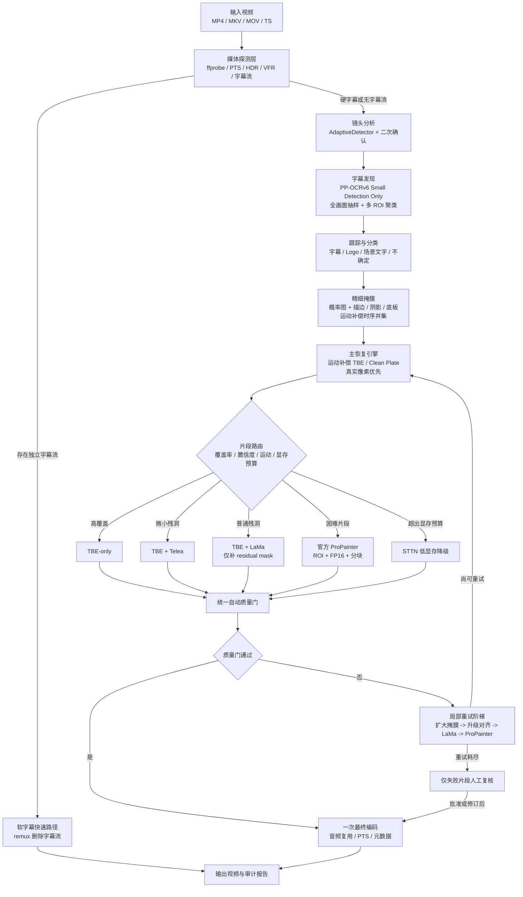

# 总体技术架构

> 本文是完整规范的模块化摘录。实现冲突时，以根目录单文件完整规范和版本更高的 ADR 为准。

# 3. 总体技术架构

## 3.0 总体处理流程（Mermaid 文本架构图）

**纯文字路径：** 输入探测 -> 软字幕无损路径或硬字幕处理 -> 镜头切分 -> 字幕发现与分类 -> 精细掩膜 -> TBE 真实背景恢复 -> 片段路由 -> 局部修补/视频修复 -> 质量门 -> 局部重试或最终编码。

## 3.1 分层设计

系统划分为六层：

1. **媒体与作业层**：输入发现、ffprobe、软字幕快速路径、作业状态和断点；
2. **理解层**：镜头切分、字幕发现、轨迹跟踪、字幕/Logo/场景文字分类；
3. **掩膜层**：文字概率图、描边/阴影/底板扩展、跨帧运动补偿；
4. **恢复层**：TBE、Telea、LaMa、官方 ProPainter、STTN；
5. **质量层**：残字、闪烁、接缝、保真、清晰度、颜色和自动重试；
6. **交付层**：一次最终编码、流复用、审计报告和联系表。

## 3.2 核心原则

- **真实像素优先于生成像素。**
- **片段级路由优先于整条视频选模型。**
- **模型只看字幕 ROI，非字幕区域原样保留。**
- **不跨镜头引用。**
- **不确定结果必须显式暴露。**
- **每个重模型都在隔离进程中，所有中间状态可恢复。**

---
