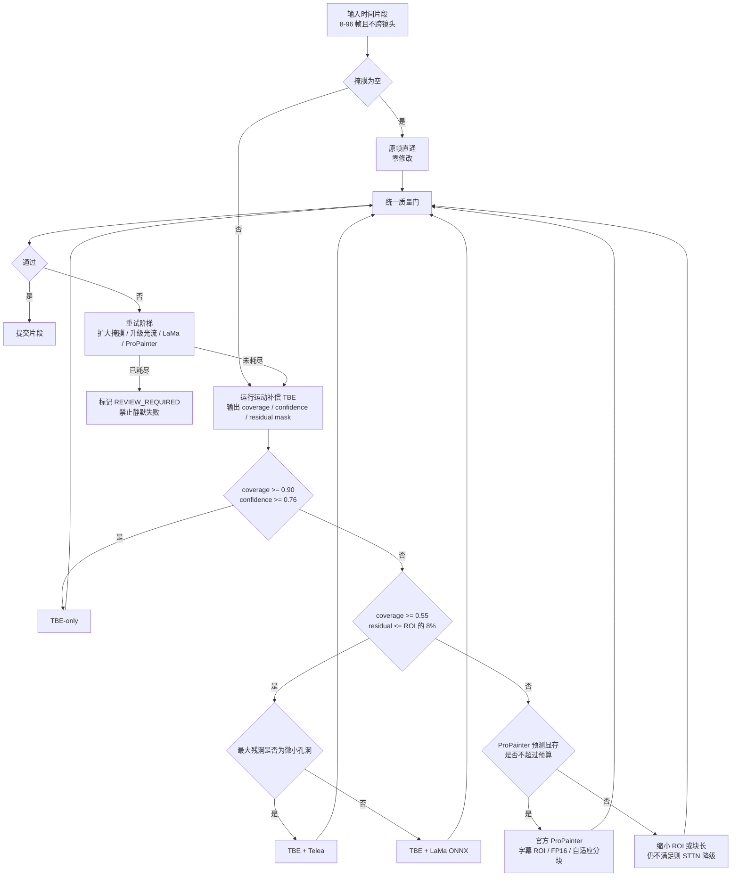

# 片段路由与修复模型

> 本文是完整规范的模块化摘录。实现冲突时，以根目录单文件完整规范和版本更高的 ADR 为准。

# 10. 片段级模型路由

## 10.0 片段路由决策图（Mermaid 文本架构图）



**决策优先级：** 原帧直通 > 真实像素恢复 > 传统微孔修补 > LaMa 小范围生成 > ProPainter 困难视频修复 > STTN 资源降级 > 人工复核。

## 10.1 片段划分

路由粒度为同一镜头内的时间片段，默认 8-96 帧。以下事件切片：

- 字幕轨迹出现/消失；
- ROI 或 mask 面积突变；
- clean-plate coverage 跨阈值；
- 运动分数显著变化；
- 前景穿越字幕；
- 切镜。

## 10.2 默认路由阈值

```python
if mask_is_empty:
    route = COPY
elif coverage >= 0.90 and confidence >= 0.76 and flicker_risk <= 0.38:
    route = TBE_ONLY
elif coverage >= 0.55 and residual_ratio_of_roi <= 0.08:
    if largest_residual_component <= micro_hole_threshold:
        route = TBE_TELEA
    else:
        route = TBE_LAMA
else:
    if predicted_propainter_vram <= budget:
        route = OFFICIAL_PROPAINTER
    else:
        route = STTN_FALLBACK
```

这些阈值是初始值，必须通过项目 golden set 校准。

## 10.3 何时直接进入官方 ProPainter

满足任一：

- coverage < 0.55；
- 平均光流置信度 < 0.52；
- 前景穿越分数 > 0.35；
- 字幕始终存在且无有效 clean plate；
- mask 占整帧 > 6%；
- 动态底板、复杂卡拉 OK 或装饰字造成大面积残洞；
- TBE + LaMa 质量门失败。

## 10.4 高风险转人工复核

- mask 占整帧 > 18%；
- 轨迹字幕置信度 < 0.45；
- 镜头短于 5 帧；
- 严重运动模糊 > 0.82；
- 满屏弹幕或字幕与关键 UI 高度重叠。

---


# 11. 空间修补：Telea、LaMa 与 MI-GAN

## 11.1 Telea

只处理等效直径很小的连通域，例如 1080p 下不超过约 24 px。它几乎不增加依赖，CPU 速度快，但不能处理复杂纹理和长条大洞。

## 11.2 LaMa ONNX

约束：

- 输入是 `residual_mask`，不是完整字幕 mask；
- 只裁剪 residual bbox + 64 px 上下文；
- 512 tile，64 overlap；
- CUDA 用 FP16，Intel 优先 OpenVINO；
- 合成时非 residual 区严格使用 TBE/原图，不允许 LaMa 改写整块 ROI。

逐帧 LaMa 的闪烁风险通过“只生成少量残洞”大幅降低。仍需运行时序 QC。

## 11.3 MI-GAN

可作为 CPU 经济模式插件。适合对吞吐高于质量的设备；默认关闭，不应成为平衡模式基线。

---


# 12. 官方 ProPainter 适配规范

## 12.1 只处理 ROI

对一个片段取所有 residual mask 的联合 bbox，增加 48-96 px 上下文，裁剪尺寸对齐到 8 或 16。模型输出只通过 soft mask 合成回原帧；ROI 外不经过模型。

## 12.2 块处理

平衡模式起始参数：

```yaml
fp16: true
subvideo_length: 32
neighbor_length: 6
ref_stride: 10
chunk_overlap_frames: 8
roi_padding_1080p: 64
```

- 不允许 chunk 跨镜头；
- 输出只提交 chunk 中间有效区；
- 重叠区以时间权重融合；
- 每个 chunk 完成后写 checkpoint。

## 12.3 显存预算预测

不能只按分辨率线性外推，因为时序模型还依赖帧数和内部特征。采用两层预算：

1. 经验估算表：分辨率、帧数、精度；
2. 当前设备冷启动 micro-benchmark，建立 `(pixels, frames, fp16) -> peak_vram` 回归。

预留：

```text
usable_vram = total_vram - driver_reserve - model_reserve - safety_margin
safety_margin = max(1024 MB, total_vram * 0.12)
```

## 12.4 OOM 降级阶梯

1. 清理缓存并重启当前 Worker；
2. `subvideo_length: 32 -> 24 -> 16`；
3. `neighbor_length: 6 -> 4`；
4. ROI padding 减小，但不得低于 32 px；
5. ROI 内等比降采样到 0.85/0.70；
6. 切换 STTN；
7. 仍失败则 `REVIEW_REQUIRED`。

禁止在同一 GPU 并发两个重视频模型任务。

## 12.5 许可证

官方 ProPainter 为非商用许可，符合本项目当前个人/非商用前提。即使外层封装项目使用 MIT，也不能改变官方权重的许可证。模型 manifest 必须记录许可证和来源。

---
