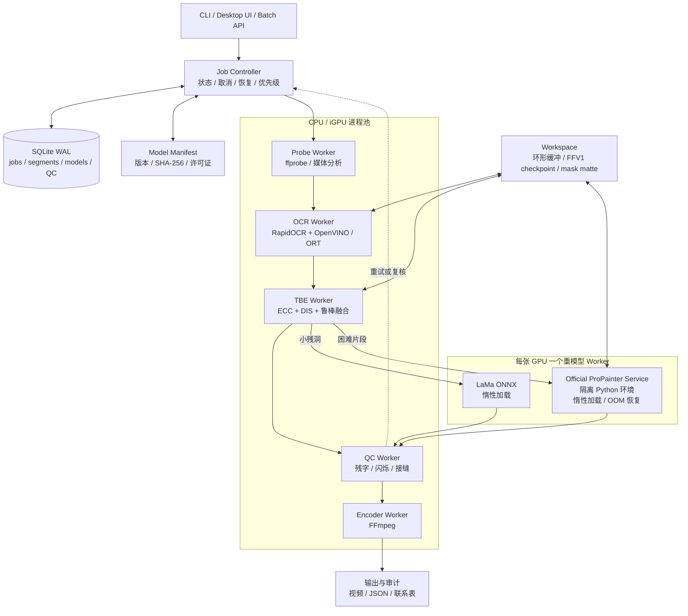

# 运行时部署与资源控制

> 本文是完整规范的模块化摘录。实现冲突时，以根目录单文件完整规范和版本更高的 ADR 为准。

# 14. 运行时与部署架构

## 14.0 运行时部署图（Mermaid 文本架构图）



**部署约束：** 主控制器与轻量模块使用现代 Python 环境；官方 ProPainter 使用独立、冻结依赖的 Worker；每张 GPU 同时只运行一个重模型任务。

## 14.1 Worker 分工

- `Probe Worker`：ffprobe、流映射、VFR/HDR/隔行分析；
- `OCR Worker`：抽样、检测、轨迹候选；
- `TBE Worker`：全局配准、DIS、参考选择和融合；
- `Spatial Worker`：Telea/LaMa；
- `ProPainter Worker`：每张 GPU 仅一个；
- `QC Worker`：质量检测；
- `Encoder Worker`：最终 mux/encode。

OCR、TBE、QC 可以在 CPU 上流水并行；重 GPU Worker 串行。编码可与下一条视频的分析重叠，但需要限制 I/O 并发。

## 14.2 队列与背压

采用有界队列：

```text
probe_queue: 4 jobs
ocr_queue: 2 jobs
reconstruction_queue: 2 shots
heavy_gpu_queue: 1 active + 2 waiting
encode_queue: 2 jobs
```

当工作盘空间、RAM 或显存达到高水位时，控制器暂停上游解码，而不是继续缓存帧。

## 14.3 帧交换

优先级：

1. 同进程：NumPy/共享内存环形缓冲；
2. 跨进程：shared memory + manifest；
3. 跨环境重模型：FFV1 小片段或无损 PNG sequence；
4. 不使用低码率 MP4 中间文件。

长视频不落盘全部 PNG。只有断点、重模型隔离和失败调试需要持久化片段。

## 14.4 模型 manifest

每个模型记录：

```yaml
name: propainter
version: upstream-v0.1.0
sha256: ...
license: NTU-S-Lab-1.0-noncommercial
source: https://github.com/sczhou/ProPainter
runtime: propainter-worker-py310-cu12
minimum_runtime_version: ...
```

默认拒绝未知哈希；允许调试绕过时必须写入审计。

---
