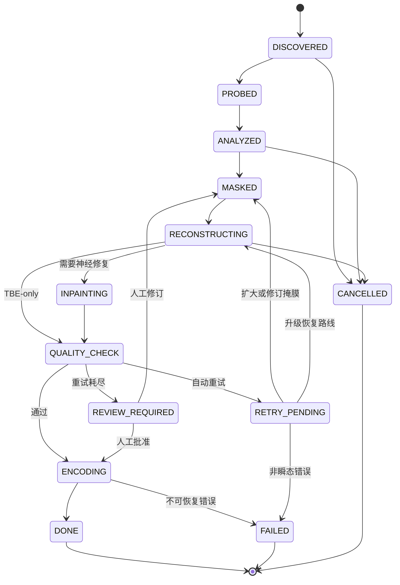

# 作业状态、数据契约与 API

> 本文是完整规范的模块化摘录。实现冲突时，以根目录单文件完整规范和版本更高的 ADR 为准。

# 15. 作业状态、数据库与断点

## 15.0 作业状态机（Mermaid 文本架构图）



**状态原则：** 所有阶段必须幂等；恢复时从最近的有效 checkpoint 继续；失败片段不应使已完成片段失效。

状态：

```text
DISCOVERED -> PROBED -> ANALYZED -> MASKED
-> RECONSTRUCTING -> INPAINTING(optional)
-> QUALITY_CHECK -> ENCODING -> DONE
```

异常分支：`RETRY_PENDING`、`REVIEW_REQUIRED`、`FAILED`、`CANCELLED`。

SQLite 使用 WAL 与外键，至少包含：

- `jobs`；
- `media_probe`；
- `shots`；
- `subtitle_tracks`；
- `segments`；
- `quality_reports`；
- `artifacts`；
- `model_runs`；
- `events`。

幂等键：

```text
(input_hash, config_hash, model_manifest_hash)
```

若三者相同且输出通过完整性校验，可直接复用。配置或模型变化只使受影响阶段失效，例如改变最终编码参数不应重新跑 OCR 和 inpaint。

---


# 18. 稳定接口与数据契约

核心对象：

- `ProbeResult`；
- `Shot`；
- `TextDetection`；
- `SubtitleTrack`；
- `MaskFrame`；
- `MotionField`；
- `CleanPlateResult`；
- `SegmentFeatures`；
- `RouteDecision`；
- `InpaintRequest/Result`；
- `QualityReport`；
- `ModelManifestEntry`。

核心协议：

```python
class TextDetector(Protocol):
    def detect(self, frames, rois, tier): ...

class MaskGenerator(Protocol):
    def build(self, detections, tracks, frames): ...

class CleanPlateEngine(Protocol):
    def reconstruct(self, frames, masks, shot): ...

class SegmentRouter(Protocol):
    def decide(self, features, budget): ...

class InpaintEngine(Protocol):
    def run(self, request): ...

class QualityGate(Protocol):
    def evaluate(self, original, output, masks): ...
```

接口细节见随附 `vsrx_interfaces.py`。插件必须返回模型哈希、耗时和峰值资源，不能只返回图像。

---


# 19. CLI 与可选 API

## 19.1 CLI

```bash
vsrx process /data/in \
  --output /data/out \
  --profile balanced \
  --recursive \
  --device cuda:0 \
  --review-dir /data/review
```

常用选项：

```text
--subtitle-roi x1,y1,x2,y2
--time-range start,end
--remove-soft-subtitles
--preserve-soft-subtitles
--profile fast|balanced|quality|cpu_economy
--max-vram-mb
--disable-propainter
--export-masks
--import-masks
--resume
--rerun-failed
--rerun-segment SEGMENT_ID
--dry-run-analysis
```

## 19.2 本地 API

建议只做薄 API：

```text
POST /jobs
GET  /jobs/{id}
POST /jobs/{id}/cancel
POST /jobs/{id}/resume
GET  /jobs/{id}/segments
POST /jobs/{id}/segments/{sid}/retry
GET  /jobs/{id}/report
```

不把视频帧经 JSON 传输；API 只传路径/对象存储引用和配置。

---
